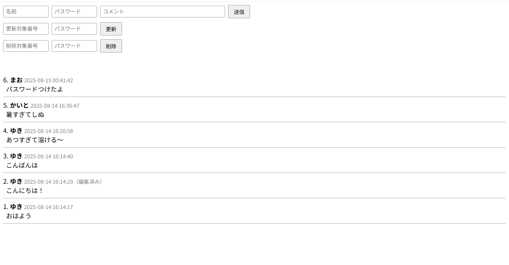

# PHP 掲示板（TECH-BASE インターンシップ課題）

このリポジトリは、[TECH-BASE プログラミングインターンシップ](https://tech-base.net/)で作成した PHP + MySQL の掲示板アプリケーションです。  
投稿・編集・削除が可能で、パスワードによる認証機能も実装しています。

## 機能一覧
- 名前・コメント・パスワードを入力して新規投稿
- パスワード認証による投稿編集
- パスワード認証による投稿削除
- 投稿一覧の表示（新しい順）

## 動作画面

